# Action Proposal and Confirmation Flow

**Status:** Prompt 18 implemented; human approval required before Prompt 19
**Selected action:** `candidate.update_start_date`
**Execution mode:** Mock only
**Execution status:** Disabled and not implemented

## Review boundary

Prompt 18 prepares one action, displays its exact effect, issues a confirmation
challenge, and records an accepted or rejected intent. It does not call
`execute_approved_action`, create an `action_executions` row, write mock OrkaATS
state, or write any Google Sheet. A confirmed proposal is only
`execution_ready=true`; every response also says `execution_enabled=false` and
`execution_state=not_started`.

OrkaATS remains authoritative for candidate visibility, the current start-date
value, action availability, permission, business validation, and any future
write. For Prompt 18, adapter availability means the configured mock adapter can
freshly resolve trusted identity, context, authorization, action availability,
record visibility, and the current permitted field value. The mock adapter still
does not advertise execution capability.

## Versioned catalog entry

The only supported action is catalog version `1.0.0`, revision `rev-002`:

| Property | Approved Prompt 18 value |
|---|---|
| Action ID | `candidate.update_start_date` |
| Owning app | `orka_ats` |
| Target | One visible `candidate` |
| Required permission | `candidate.update_start_date` |
| Input schema | Exactly `{ "start_date": "YYYY-MM-DD" }`; extra fields forbidden |
| Validation | Real complete ISO calendar date; must differ from the current visible value |
| Confirmation | Required, one time, 256-bit random challenge |
| Reversible | `true` (catalog assertion for the mock POC; execution semantics remain unapproved) |
| Sensitivity | `low`; old/new preview values remain confidential and excluded from logs |
| Execution mode | `mock_only` |
| Failure behavior | `fail_closed_without_execution` |
| Discovery scope | Administrator, candidate profile, candidate profile review feature |

The action catalog also declares the allowed audit field names. Catalog presence
alone is insufficient: the service supports the exact action ID above, requires
an active matching version/schema, and independently requires the adapter's
current permission and available-action facts.

The date rules are deliberately narrow preparation rules, not a claim that all
otherwise valid dates satisfy OrkaATS business policy. Allowed employment states,
date ranges, timezone/partial-date rules, concurrency behavior, rollback, and
receipt semantics remain Prompt 19 review items. OrkaATS must revalidate them
before any future write.

## State machine

```mermaid
stateDiagram-v2
    [*] --> Proposed: trusted checks pass + preview persisted
    Proposed --> Confirmed: issued challenge accepted once
    Proposed --> Cancelled: issued challenge explicitly rejected
    Proposed --> Expired: proposal or challenge TTL elapsed
    Confirmed --> [*]: Prompt 18 stops; execution disabled
    Cancelled --> [*]: terminal
    Expired --> [*]: terminal

    state Confirmation {
        [*] --> Issued
        Issued --> Accepted: exact token + parameters + binding
        Issued --> Rejected: user cancel or safe revalidation failure
        Issued --> Expired: TTL elapsed
        Accepted --> [*]: not consumed by execution in Prompt 18
        Rejected --> [*]
        Expired --> [*]
    }
```



Proposal and confirmation status are separate database records. Conditional
database updates accept transitions only from `proposal=proposed` and
`confirmation=issued`; this provides one winner for duplicate/racing local
requests. `confirmation=consumed` and `proposal=executed|failed` already exist as
future contract states but no Prompt 18 code can enter them.

## Request sequence

```mermaid
sequenceDiagram
    participant W as Untrusted widget
    participant F as OrkaFin action service
    participant C as Trusted context service
    participant A as Mock OrkaATS adapter
    participant D as OrkaFin SQLite

    W->>F: POST action-proposals (action, date, context hint)
    F->>C: Resolve fresh trusted context
    C->>A: Identity, permission, action, record, safe current value
    A-->>C: Filtered typed facts
    C-->>F: Verified request-scoped context
    F->>D: Permission audit
    F->>D: Proposal + challenge hash + proposal/issued audits
    F-->>W: Exact preview + plaintext challenge once
    W->>F: POST confirmations (decision, same date, challenge, context hint)
    F->>D: Load issued state; check TTL/hash/replay
    F->>C: Re-resolve user/workspace/target and, for accept, permission/current value
    C->>A: Fresh read-only trusted checks
    A-->>C: Filtered typed facts
    F->>D: Atomic accepted/rejected/expired transition + audit
    F-->>W: Execution-ready or cancelled state; execution disabled
    Note over F,A: execute_approved_action is never called
```

Cancellation validates the challenge and user/workspace/target binding but does
not require continued action permission, because withdrawing intent must remain a
safe operation. Acceptance additionally revalidates catalog version, permission,
current action availability, target visibility, and the previewed old value.

## API contract

### Create proposal

`POST /api/v1/action-proposals`

```json
{
  "action_id": "candidate.update_start_date",
  "parameters": {"start_date": "2026-10-06"},
  "context": {
    "app_id": "orka_ats",
    "page": "candidate_profile",
    "selected_entity": {"type": "candidate", "id": "CAND-1042"}
  }
}
```

The request has no user, role, workspace, permission, available-action,
parameter-hash, request-ID, or idempotency field. Those facts are trusted or
server-created.

The exact synthetic review preview is:

```json
{
  "action_id": "candidate.update_start_date",
  "action_version": "1.0.0",
  "owning_app_id": "orka_ats",
  "owning_app_display_name": "Mock OrkaATS",
  "target_candidate_id": "CAND-1042",
  "affected_user_id": "mock-user-admin",
  "affected_user_display_name": "Synthetic Administrator",
  "affected_workspace_id": "workspace_recruiting_alpha",
  "affected_workspace_display_name": "Synthetic Recruiting Alpha",
  "summary": "Prepare a candidate start-date update for confirmation.",
  "changes": [
    {"field_label": "Start date", "old_value": "2026-08-17", "new_value": "2026-10-06"}
  ],
  "reversible": true,
  "warnings": [
    "Mock confirmation only: confirming does not update OrkaATS or candidate data.",
    "Execution stays disabled until a separate Prompt 19 human approval.",
    "OrkaATS must revalidate current permissions, state, and business rules before any future execution."
  ]
}
```

The response also contains `proposal_id`, `proposal_status=proposed`, both expiry
timestamps, `execution_ready=false`, `execution_enabled=false`,
`execution_state=not_started`, and the plaintext `confirmation_token`. It does
not contain the parameter hash or confirmation-token hash.

### Accept or cancel confirmation

`POST /api/v1/action-proposals/{proposal_id}/confirmations`

```json
{
  "decision": "accept",
  "confirmation_token": "<one-time challenge from proposal response>",
  "parameters": {"start_date": "2026-10-06"},
  "context": {
    "app_id": "orka_ats",
    "page": "candidate_profile",
    "selected_entity": {"type": "candidate", "id": "CAND-1042"}
  }
}
```

Use `decision=reject` for cancellation. An accepted response is:

```json
{
  "proposal_status": "confirmed",
  "confirmation_status": "accepted",
  "execution_ready": true,
  "execution_enabled": false,
  "execution_state": "not_started",
  "message": "Confirmation accepted and execution-ready. Execution is disabled; no action was executed."
}
```

The confirmation response never echoes the plaintext challenge or either hash.

## Hash, TTL, and idempotency design

The parameter digest is SHA-256 over UTF-8 canonical JSON with sorted keys and no
insignificant whitespace. The canonical object is the existing typed action
parameter, including `schema_version=v1`, `kind=date`,
`parameter_id=start_date`, and its validated date value. Reordering JSON input
cannot change the digest; adding an unknown field fails request validation.

The confirmation challenge uses `secrets.token_urlsafe(32)`, providing 256 random
bits before URL-safe encoding. OrkaFin returns plaintext once and persists only
`SHA-256(plaintext)`. Constant-time comparisons check the supplied digest. The
confirmation row separately binds:

- proposal ID (whose record binds action/version, target, and future idempotency);
- verified user ID;
- verified workspace ID; and
- exact parameter digest.

Both proposal and challenge expire after
`ORKAFIN_CONFIRMATION_TTL_SECONDS`, default 300 seconds and constrained to
60–3,600 seconds. Expiry uses `now >= expires_at` and atomically marks both states
expired. A bad token, altered parameters, or wrong binding does not consume a
still-valid challenge, preventing an unrelated caller from cancelling the real
user's intent.

The server generates one `action-<UUID>` idempotency key per proposal and stores
it under the existing unique constraint. The browser cannot choose it. Prompt 19
must reuse that exact key for adapter execution/reconciliation; it must not create
a second execution key or blindly retry an ambiguous write.

## Audit records

There is no public audit-read endpoint. The action service writes these bounded,
append-only records:

| Event | Outcome | Safe details |
|---|---|---|
| `action_permission_checked` | `allowed` or `denied` | Phase, `action` check, stable decision code, action version, optional proposal ID |
| `action_proposed` | `allowed` | Proposal ID, action version, `proposed` status |
| `action_confirmation_issued` | `allowed` | Proposal ID, confirmation ID, TTL seconds |
| `action_confirmed` | `allowed` | Proposal/confirmation IDs, `accepted`, execution state `not_started` |
| `action_confirmation_rejected` | `denied` | Proposal/confirmation IDs and safe reason code |
| `action_confirmation_expired` | `denied` | Proposal/confirmation IDs and `ttl_elapsed` |
| `action_tampering_rejected` | `denied` | Proposal ID and a safe mismatch/replay reason code |

Actor, workspace, target reference, action ID, request ID, and correlation ID use
typed top-level audit fields. Details contain no old/new values, hidden candidate
data, plaintext challenge, parameter hash, token hash, raw body, or exception.

## Threat controls and failure behavior

| Threat | Control |
|---|---|
| Forged identity/role/permission/action | Browser schema excludes them; trusted context is freshly adapter-resolved |
| Invisible or guessed candidate | Exact record visibility and candidate summary required; safe non-disclosing denial |
| Unknown action/tool | Exact active catalog ID and exact service implementation required; no dispatch dictionary |
| Malformed/no-op value | Strict one-field schema, real calendar-date parser, compare with permitted current value |
| Parameter/target tampering | Canonical digest plus proposal/user/workspace/target binding and fresh context comparison |
| Token theft or database disclosure | 256-bit secret, hash-only persistence, no logs/hash responses, short TTL |
| Replay or concurrent accept | Conditional one-time state transition; terminal retry audited and returns conflict |
| Permission revocation or stale preview | Acceptance rechecks action/permission/visibility and current old value; fails closed |
| Adapter outage | No proposal or confirmation acceptance is fabricated from browser/cached/model data |
| Fabricated write success | No execution call/result/receipt path; every response explicitly says no action executed |

## Human checkpoint before Prompt 19

Review and explicitly approve or reject:

1. The selected action ID, mock-only scope, and exact `{start_date}` schema.
2. The preview fields, wording, old/new value disclosure, and three warnings.
3. The 300-second shared proposal/challenge TTL.
4. Canonical parameter hashing and user/workspace/proposal/target/action-version binding.
5. The one-time transition and non-consuming behavior for invalid attempts.
6. Every audit event, outcome, safe detail field, and reason code.
7. Server-generated proposal idempotency and required Prompt 19 reuse.
8. Residual business-validation, concurrent-state, receipt, rollback, ambiguous
   failure, real authentication, and adapter-execution risks.

Prompt 19 must not begin until this checkpoint is recorded. If approved, the
handoff is action `candidate.update_start_date` version `1.0.0`, the two endpoints
above, shared 300-second default TTL, server-generated proposal idempotency, and a
confirmed/accepted state that has never executed.
