# Approved Mock Action Flow

**Status:** Prompt 19 implemented for local mock mode
**Selected action:** `candidate.update_start_date` version `1.0.0`
**Execution scope:** Isolated synthetic `MockOrkaATSAdapter` state only
**Live OrkaATS / Apps Script / Google Sheet execution:** Not implemented or proven

## Boundary

OrkaFin can prepare, confirm, and execute exactly one catalogued action. It is not
a generic tool runner. The action changes `var/mock_orka_ats_state.json`, which is
owned by the mock adapter and excluded from version control. It never writes an
OrkaFin candidate record or the OrkaATS Google Sheet.

OrkaATS remains authoritative for identity, workspace, candidate visibility,
action permission, current candidate state, business validation, the write, and
the execution receipt. OrkaFin reports success only from a schema-valid matching
receipt returned by the selected mock adapter.

## Exact action

| Property | Value |
|---|---|
| Action ID | `candidate.update_start_date` |
| Action version | `1.0.0` |
| Owner | `orka_ats` |
| Target | One visible `candidate` on `candidate_profile` |
| Required permission | `candidate.update_start_date` |
| Input | Exactly `{ "start_date": "YYYY-MM-DD" }` |
| Preparation rules | Real ISO date; different from the currently visible value |
| Confirmation | Required, expiring, one-time, hash-only persistence |
| Execution | Mock adapter only; separate explicit click |
| Reversible | Catalogued as reversible in mock mode only |

No other action ID, parameter shape, target type, adapter, or execution mode is
accepted.

## State machine

```mermaid
stateDiagram-v2
    [*] --> Proposed: trusted checks + exact preview
    Proposed --> Confirmed: one-time challenge accepted
    Proposed --> Cancelled: user rejects
    Proposed --> Expired: challenge TTL elapsed
    Confirmed --> Executed: valid successful adapter receipt
    Confirmed --> Failed: rejected, failed, or unknown outcome
    Executed --> Executed: API replay returns stored result; no adapter call
    Failed --> Failed: API replay returns stored result; no adapter call

    state Confirmation {
        [*] --> Issued
        Issued --> Accepted
        Issued --> Rejected
        Issued --> Expired
        Accepted --> Consumed: execution reservation wins once
    }
```



The execution service inserts a unique execution reservation and atomically moves
the confirmation from `accepted` to `consumed` before calling the adapter. A
unique proposal constraint and the existing unique idempotency key ensure one
execution row and one adapter request winner. If the process stops after the
reservation, the durable result remains conservative `unknown` and is reconciled
by the same idempotency key; it is never blindly retried.

## Request sequence

1. `POST /api/v1/action-proposals` resolves trusted identity, context,
   permission, visibility, action availability, and current start date. It stores
   the exact parameters and SHA-256 digest, then returns a preview and one-time
   confirmation token.
2. `POST /api/v1/action-proposals/{proposal_id}/confirmations` verifies the token,
   parameter digest, user, workspace, target, TTL, catalog version, current
   permission, and previewed old value. Acceptance makes the proposal
   execution-ready but performs no write.
3. The widget displays a separate `Execute approved update` button. It does not
   execute automatically after confirmation.
4. `POST /api/v1/action-proposals/{proposal_id}:execute` re-resolves trusted
   identity and context, then rechecks candidate visibility, explicit action
   permission, available action ID, current candidate value, active definition
   version, exact stored parameter shape, and recomputed parameter hash.
5. OrkaFin consumes the confirmation once, persists a reservation, and sends one
   versioned `ExecuteApprovedActionRequest` with the current request ID and the
   proposal's server-generated idempotency key.
6. The mock adapter repeats permission, visibility, action/version, parameter
   hash, expected-old-value, no-op, and idempotency validation. It atomically
   updates its isolated state and returns a typed receipt.
7. OrkaFin validates the response and receipt bindings before storing and
   displaying the final result.

## Execution API

### Request

`POST /api/v1/action-proposals/{proposal_id}:execute`

```json
{
  "context": {
    "app_id": "orka_ats",
    "page": "candidate_profile",
    "selected_entity": {"type": "candidate", "id": "CAND-1042"}
  }
}
```

The browser supplies no user, role, permission, workspace, action definition,
parameter hash, request ID, idempotency key, execution outcome, or receipt.

### Successful response

```json
{
  "schema_version": "v1",
  "execution": {
    "schema_version": "v1",
    "execution_id": "execution-...",
    "proposal_id": "proposal-...",
    "action_id": "candidate.update_start_date",
    "action_version": "1.0.0",
    "owner_app_id": "orka_ats",
    "target": {
      "schema_version": "v1",
      "app_id": "orka_ats",
      "entity_type": "candidate",
      "entity_id": "CAND-1042"
    },
    "status": "succeeded",
    "request_id": "00000000-0000-4000-8000-000000001903",
    "idempotency_key": "action-...",
    "adapter_receipt": {
      "schema_version": "v1",
      "receipt_id": "receipt-...",
      "adapter_id": "mock_orka_ats",
      "owner_app_id": "orka_ats",
      "action_id": "candidate.update_start_date",
      "action_version": "1.0.0",
      "target": {
        "schema_version": "v1",
        "app_id": "orka_ats",
        "entity_type": "candidate",
        "entity_id": "CAND-1042"
      },
      "request_id": "00000000-0000-4000-8000-000000001903",
      "idempotency_key": "action-...",
      "adapter_transaction_reference": "mock-transaction-...",
      "outcome": "succeeded",
      "safe_failure_code": null,
      "executed_at": "2026-07-13T20:00:00Z",
      "received_at": "2026-07-13T20:00:00Z"
    },
    "safe_message": "Mock OrkaATS confirmed the candidate start date was updated.",
    "completed_at": "2026-07-19T21:00:00Z"
  },
  "idempotent_replay": false
}
```

A duplicate endpoint call returns the original persisted execution with
`idempotent_replay=true`. It does not call the adapter again.

## Failure and reconciliation rules

| Condition | Result | User-safe assertion |
|---|---|---|
| Action permission or candidate visibility revoked, state/version/hash conflict, expired confirmation | HTTP denial/conflict plus persisted `rejected` or `conflict` result | No adapter request; no change from this execution |
| Explicit adapter validation/conflict/forbidden failure | `failed` | `OrkaATS could not complete the request. No changes were made.` |
| Valid failed receipt | `failed` with receipt | Same proven no-change message |
| Timeout, unavailable transport, unexpected adapter exception | `unknown` | Outcome not asserted; reconcile by idempotency key |
| Malformed or mismatched receipt | `unknown`, receipt omitted | Outcome not asserted even if mock state changed |
| Duplicate proposal/idempotency call | Stored result, `idempotent_replay=true` | No second adapter call |

The unknown message is: `OrkaATS did not confirm the outcome. Do not retry this
action; reconcile it using the returned idempotency key.` OrkaFin intentionally
has no automatic retry loop or generic reconciliation/rollback engine.

The mock adapter keeps receipts indexed by idempotency key in its isolated state.
An operator can compare the OrkaFin execution row with that adapter-owned receipt.
A real adapter must define an authenticated reconciliation operation before live
writes can be approved.

## Audit sequence

A successful first execution appends:

1. `action_execution_attempted`;
2. `action_permission_checked` with `phase=execution`;
3. `action_adapter_requested` after one-time reservation;
4. `action_execution_succeeded` (or `failed` / `unknown`); and
5. `action_final_result` containing only safe IDs and status codes.

Pre-adapter denials omit `action_adapter_requested`. Replays append an attempt and
final replay result but never a second adapter-request or success event. Audit
details exclude the confirmation plaintext/hash, parameter hash, old/new value,
candidate fields, raw request/response, and adapter transaction reference.

## Reset and manual compensation

Reset all isolated mock values and receipts before a demo or test run:

```bash
python -m orkafin.adapters.orka_ats.seed --reset
```

Because this one mock action is catalogued as reversible, the documented manual
compensating operation is to set the candidate's prior synthetic start date
through the adapter-owned state utility after verifying the original receipt:

```python
from datetime import date

from orkafin.adapters.orka_ats import MockOrkaATSStateStore

MockOrkaATSStateStore().set_candidate_start_date("CAND-1042", date(2026, 8, 17))
```

This is an operator-only mock-state operation. It bypasses no real OrkaATS rule,
is not exposed by the API or widget, and is not a general rollback engine.

## Local demo

1. Run the reset and migrations.
2. Set `ORKAFIN_LOCAL_FIXTURE_SUBJECT=admin` and start the local service.
3. Open `/demo`, select `candidate_profile` and `CAND-1042`.
4. Preview a different start date, confirm it, then click `Execute approved
   update` separately.
5. Verify the adapter-confirmed success and resolve context again to see the
   changed synthetic value.
6. Repeat the execution request only for test verification: the stored result is
   returned as an idempotent replay and the mock state has one receipt.

## Prompt 20 handoff

- Endpoint: `POST /api/v1/action-proposals/{proposal_id}:execute`.
- Receipt: `AdapterExecutionReceipt` nested in `ActionExecutionResult`.
- One server-generated idempotency key is shared by proposal, adapter request,
  receipt, execution row, replay response, and manual reconciliation.
- Unknown outcomes are terminal in V1 and require operator reconciliation; no
  blind retry exists.
- Unsupported: every other action, real Apps Script execution, real candidate
  Sheet writes, background/batch actions, cross-app workflows, automated rollback,
  and production authentication.
- Prompt 20 must preserve the explicit statement that local mock tests do not
  prove real OrkaATS integration.
