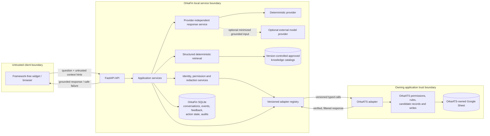

# Local V1 Architecture

**Status:** Local V1 handoff complete; final human acceptance pending

## Architectural intent

Local V1 is one modular FastAPI service with explicit internal interfaces. OrkaFin
coordinates trusted context, approved knowledge, and response generation; it is
not the owner or final authority for OrkaATS candidate data. All automated tests
and the local demonstration use a deterministic provider and mock identity/adapter
unless a later prompt explicitly enables an optional provider.

The frozen architecture decision is to preserve these responsibilities as typed
module boundaries in one process. Neither convenience in an endpoint nor provider
capability may bypass an adapter, permission, persistence, or receipt boundary.

## Component diagram and trust boundaries



The arrows do not grant equal trust. The browser is always untrusted. The
OrkaFin service is trusted to orchestrate and protect its own records, but it is
not trusted to invent candidate permissions or bypass OrkaATS rules. The
OrkaATS adapter response is trusted only when its identity and transport are
valid and only for that response's lifetime. External-model and retrieved text
are data-processing inputs, never authorities.

The mock adapter and fixture identity resolver simulate the owning application
boundary for tests. A local mock identity is not production authentication. A
successful mock flow proves only local contract behavior.

## Implemented modules in one service

Local V1 uses package name `orkafin` and a `src/orkafin` layout:

| Module | Responsibility | Must not do |
|---|---|---|
| `api` | HTTP schemas, routing, request IDs, safe errors | Encode authorization policy |
| `core` | Settings, logging/redaction, common runtime concerns | Store secrets in defaults |
| `domain` | Versioned strict value objects and contracts | Define candidate persistence |
| `application` | Guidance, permission, recommendation, and optional action workflows | Access Sheets or trust client claims |
| `adapters` | General adapter protocol, registry, OrkaATS implementations | Expose unrestricted storage access |
| `infrastructure` | SQLAlchemy repositories and local persistence | Create a candidates table |
| `knowledge` | Catalog loading, validation, deterministic retrieval | Treat document instructions as policy |
| `providers` | Deterministic and optional model response providers | Decide permissions or claim action success |
| `web` | Static framework-free widget assets | Embed secrets or authoritative identity |

These are replaceable boundaries inside one deployable process. They do not
justify network-separated services in V1.

## Ownership and persistence

| Data | Owner/authority | V1 location and rule |
|---|---|---|
| Candidate record, notes, attachments, current fields | OrkaATS | Adapter-owned synthetic fixture for local testing; never OrkaFin tables |
| Candidate visibility and field/action permissions | OrkaATS | Resolved through trusted adapter inputs; never accepted from browser/model |
| Stage catalog and transition validation | OrkaATS | Approved adapter/catalog contract; authoritative values remain unresolved |
| Feature/page/help catalogs | Product documentation owners | Version-controlled files with IDs, versions, status, and permissions |
| Conversation and message state | OrkaFin | SQLite after a reviewed migration; minimized and retention-controlled |
| Meaningful user events and recommendation feedback | OrkaFin | SQLite; no keystrokes, secrets, or raw candidate notes |
| Action proposal, confirmation hash, receipt, audit | OrkaFin | SQLite if optional action is enabled; append-oriented audit semantics |
| Secrets and provider credentials | Operator/environment | Never browser, catalog, repository value, or log content |

An adapter-returned candidate summary is a permission-filtered, request-scoped
view. Caching it as a durable candidate replica is prohibited. If later
performance requires caching, a separate ADR must define fields, encryption,
authorization invalidation, and retention.

## Guidance request flow

1. The widget sends a question, a request ID (or receives one), and client context
   hints. Email, role, permissions, selected entity, and available actions in the
   request are marked untrusted.
2. The API validates sizes and versions. The application service resolves identity
   and current context through the configured adapter boundary. Unverified
   identity fails closed.
3. OrkaATS determines record visibility, field visibility, and permissions. The
   adapter returns only a redacted, typed summary; candidate notes are excluded by
   default.
4. Deterministic retrieval filters approved, active, version-compatible catalog
   entries by app, page, permission, and query terms. Help text cannot change
   policy or introduce a feature/action not present in its catalog.
5. The deterministic provider builds a grounded response. If an external model is
   configured later, it receives only the minimum redacted context and retrieved
   excerpts and may improve wording; its output is validated against allowed
   response types and sources.
6. OrkaFin stores only the minimized conversation/event facts needed by the
   workflow. Sensitive reads or denials receive safe audit records where required.
7. The API returns a source-aware response, refusal, or unavailable result. It
   never represents guidance as an executed action.

## Trusted context resolution flow

`POST /api/v1/contexts:resolve` is implemented as thin HTTP routing over
`TrustedContextResolutionService`; authorization policy remains outside the route.
The service receives the untrusted `ClientContextHint` separately from a
`TrustedSessionResolver`. The latter is supplied by server/session composition and
is never populated from request content. The public hint accepts only app/page
navigation and an optional `{type, id}` selection; identity, role, permission,
action, workspace, request-ID, and legacy hint fields fail strict validation.

The flow is fail-closed and ordered:

1. resolve the configured adapter for the hinted app;
2. ask the adapter to resolve the trusted session subject;
3. resolve adapter-owned page, workspace, and selection context;
4. fetch fresh authorization facts, evaluate app/page grants, then validate the
   allowed page through page metadata and independently fetch available actions;
5. require `candidate.view` plus the exact
   selected record grant before asking for a candidate summary;
6. convert only already filtered adapter fields to the request-scoped domain
   summary and commit the sensitive-read audit before returning it.

`ResolvedPageContext.component_trust` carries response-lifetime source evidence
for app, identity, page, workspace, selection, permissions, available actions,
and candidate summary. Optional evidence is `null` exactly when the optional
component is absent. The response never contains the original hint or upgrades a
client selection into trusted data. Its minimized public identity omits the email
that remains available in the internal verified identity during authorization and
audit construction. Unknown apps/pages are distinct 404 client/configuration
errors; adapter unavailability and timeout remain 503. See [`API.md`](API.md) for
the reviewed shape and safe error codes.

## Confirmed-action request flow (one mock action implemented)

```mermaid
sequenceDiagram
    participant W as Untrusted widget
    participant F as OrkaFin
    participant A as Trusted OrkaATS adapter
    participant O as OrkaATS authority

    W->>F: Request catalogued action + untrusted parameters
    F->>A: Resolve identity/context/permission/current safe value
    A->>O: Check record, field, action and business policy
    O-->>A: Filtered facts or denial
    A-->>F: Typed verified response
    F-->>W: Exact preview + expiring confirmation challenge
    W->>F: Explicit confirmation bound to user/workspace/parameters
    F-->>W: Execution-ready; no write yet
    W->>F: Separate explicit execution click
    F->>A: Re-resolve identity, permission and current state
    A->>O: Revalidate and execute with idempotency key
    O-->>A: Execution receipt or explicit/ambiguous failure
    A-->>F: Typed receipt/error
    F-->>W: Receipt-backed success or honest safe failure
```

The proposal and execution are separate user interactions. Confirmation tokens
are one-time, expiring, stored only as hashes, and bound to the exact user,
workspace, proposal, action version, target, and parameter hash. Execution
revalidates identity, visibility, permissions, current state, and catalog version.
Only a valid owning-adapter receipt permits a success state. Timeouts remain
unknown until reconciled; they are not rewritten as success or as “no change”
without proof.

Prompt 19 implements the adapter half only when fixture mode resolves exact
adapter ID `mock_orka_ats`. The service consumes `confirmation=accepted` once,
persists an execution reservation before dispatch, and transitions the proposal to
`executed` only for a valid successful receipt; all other terminal outcomes become
`failed`, while the execution result retains `failed`, `unknown`, `conflict`, or
`rejected` detail. Duplicate requests return the stored result and do not dispatch.
The mock's mutable JSON state is adapter-owned and separate from OrkaFin SQLite.

The live Apps Script client shell is not selected by this execution service.
Nothing in this flow proves real authentication, remote reachability, OrkaATS
business rules, Google Sheet mutation, or production receipt authority. Full
bindings and reconciliation behavior are in
[`ACTION_AND_CONFIRMATION_FLOW.md`](ACTION_AND_CONFIRMATION_FLOW.md).

## Apps Script and localhost

Apps Script server-side functions execute on Google's infrastructure. From that
runtime, `localhost` refers to the Google execution environment, not a developer's
laptop. Therefore a deployed Apps Script `UrlFetchApp` call cannot be assumed to
reach a FastAPI server bound to `127.0.0.1` on the developer machine. A browser on
that machine may reach localhost, but that is a different path, remains subject to
CORS and origin rules, and cannot make browser identity claims trustworthy.

Local V1 uses direct local browser-to-service calls and mock trusted boundaries.
Live Apps Script testing requires a deliberately exposed controlled HTTPS endpoint,
server-to-server authentication, request integrity/replay controls, an exact CORS
policy for any browser path, and deployment-mode identity testing. Those are not
silently approximated in V1.

## Failure and consistency rules

- Unknown identity, permission, feature, action, adapter response, or source fails
  closed or produces an unavailable response.
- Adapter unavailable, timeout, invalid receipt, or malformed payload never becomes
  a successful read or write.
- Provider failure falls back to deterministic response generation when safe.
- Request IDs cross API, adapter, provider, persistence, and audit boundaries.
- Logs are structured and redacted; user-facing errors contain stable safe codes,
  not stack traces.
- No interface returns hidden field names merely to explain that they were redacted
  if the field name itself is sensitive.

## Verification steps

Architecture conformance is checked by dependency and contract tests, a migration
inspection that forbids candidate persistence, security tests for forged client
claims, provider tests proving deterministic no-key operation, retrieval tests for
source grounding, and action tests requiring a valid adapter receipt. Documentation
validation must also find every linked ADR and the required trust-boundary phrases.

## Change triggers

Create or supersede an ADR before adding network-separated services, a live Apps
Script adapter, production identity, durable candidate caching, another Orka app,
semantic/vector retrieval, an additional model responsibility, or more than one
executable action. A measured constraint—not architectural fashion—must justify
the change.
